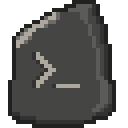

<p align="center">
  
</p>

# Rosetta

Compatibility helpers for Minecraft mods built across Fabric, Forge, and NeoForge. Optional artifacts provide networking, persistent attachments, configuration, and runtime resource handling. Gradle plugins handle shared source replacements, shaders, and datapack JSON.

[Documentation](docs/README.md) · [Setup](docs/setup.md) · [Building](docs/building.md)

| Minecraft | Loaders |
| --- | --- |
| 26.3 | Fabric, NeoForge |
| 26.2 | Fabric, NeoForge |
| 26.1–26.1.2 | Fabric, NeoForge |
| 1.21.1 | Fabric, NeoForge |
| 1.20.1 | Fabric, Forge |

The 26.1 targets share one jar per loader. Other listed versions have separate targets.

```powershell
.\gradlew.bat buildAllArtifacts
```
